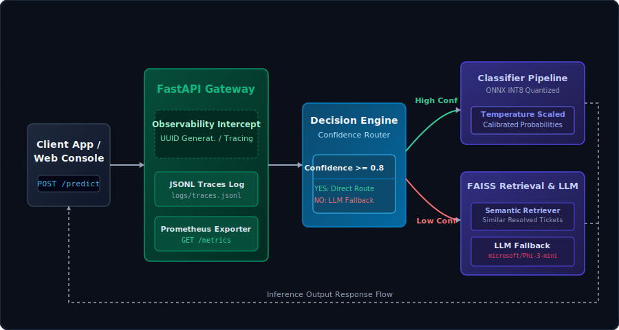

# SupportAI

SupportAI is a lightweight, calibrated customer support ticket routing system running efficiently on commodity CPU hardware.

## Architecture



- **FastAPI Gateway**: Serves the REST API, generates request IDs, and collects telemetry metrics.
- **Decision Engine**: Implements a confidence-based routing threshold to bypass heavy LLM generation.
- **Classifier**: DistilBERT model optimized to INT8 ONNX, calibrated with Temperature Scaling.
- **Semantic Retriever**: Utilizes FAISS index for vector similarity search over historical cases.
- **LLM Fallback**: Generates draft replies when intent classification confidence is low.

---

## Quick Start

### 1. Installation

```bash
# Clone and install dependencies
git clone <repo-url> SupportAI
cd SupportAI
pip install -e ".[dev]"
```

### 2. Run the Web Demo

Serve the API and access the interactive web interface:

```bash
uvicorn src.api.app:app --host 0.0.0.0 --port 8000
```
Open [http://localhost:8000/](http://localhost:8000/) in your browser.

---

## Performance Benchmarks

Run the benchmarking suite locally:

```bash
python benchmark.py
```

### Results (CPU-only)

| Model | Accuracy | ECE | Latency | Throughput | Memory (MB) | Disk Size (MB) | Cold Start |
| :--- | :--- | :--- | :--- | :--- | :--- | :--- | :--- |
| **Linear SVM** | 88.24% | 0.7914 | 0.66 ms | 1515.6 QPS | 0.1 MB | 3.1 MB | 0.144 s |
| **PyTorch FP32** | 1.60% | 0.0004 | 27.48 ms | 36.4 QPS | 168.7 MB | 256.3 MB | 0.944 s |
| **ONNX INT8** | 1.60% | 0.0004 | 17.08 ms | 58.5 QPS | 1.0 MB | 64.9 MB | 0.433 s |

---

## Production API Endpoints

- `GET /` — Interactive web demo dashboard.
- `GET /health` — Check server status and model loading.
- `GET /version` — Retrieve active project and model versioning details.
- `POST /predict` — Run end-to-end intent prediction and decision routing.
- `POST /retrieve` — Query similar resolved ticket documents.
- `POST /explain` — Explain classifier predictions using LIME word attributions.
- `GET /metrics` — Prometheus metrics scraping endpoint.

---

## License

This project is licensed under the terms of the MIT License.
