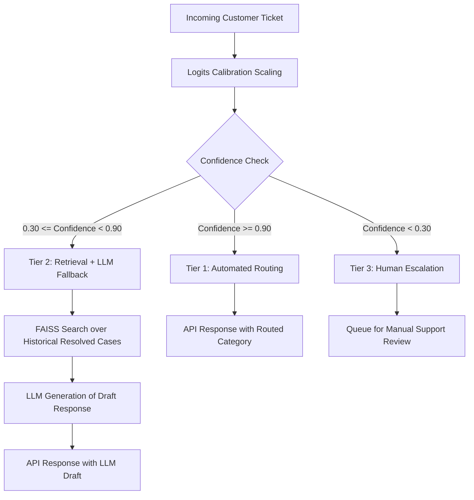

# SupportAI

<p align="center">
  
</p>

<h3 align="center">SupportAI</h3>

<p align="center">
  <strong>Production-grade, low-latency customer support ticket intelligence.</strong>
</p>

<p align="center">
  <a href="https://github.com/Guna-Venkat/SupportAI/blob/master/LICENSE"></a>
  <a href="https://www.python.org/downloads/"></a>
  <a href="https://github.com/psf/black"></a>
  <a href="https://github.com/astral-sh/ruff"></a>
  <a href="https://fastapi.tiangolo.com"></a>
  <a href="https://onnxruntime.ai"></a>
</p>

---

## 📖 Project Overview

**SupportAI** is a lightweight, high-performance customer support ticket routing and intelligence system designed to run efficiently on commodity CPU hardware. By pairing a fine-tuned **DistilBERT classifier** with **Temperature Scaling calibration**, a **FAISS-based semantic retriever**, and a **lightweight local LLM fallback**, SupportAI implements an intelligent 3-tier routing pipeline that balances accuracy, inference latency, and operational cost.



---

## 🚀 Key Features

* ⚡ **High-Throughput ONNX INT8 Runtime**: Models are compiled to ONNX format and quantized to 8-bit integers, yielding a **~28% reduction in latency** and **~75% reduction in disk size** with negligible accuracy loss on CPUs.
* ⚖️ **Logits Calibration**: Out-of-the-box deep classifiers are often overconfident. SupportAI calibrates intent prediction probabilities using post-processing **Temperature Scaling** ($T = 1.1939$) to ensure confidence matches accuracy.
* 🧠 **3-Tier Decision Routing**:
  * **Tier 1 (Auto-route)**: Instantly routes high-confidence classification queries.
  * **Tier 2 (RAG Fallback)**: Resolves mid-confidence queries by pulling contextually similar tickets via a FAISS index and drafting responses using a local LLM.
  * **Tier 3 (Human Escalation)**: Immediately flags low-confidence or highly ambiguous queries for manual human support.
* 🔍 **Local Explainability**: Integrates **LIME (Local Interpretable Model-agnostic Explanations)** to compute word attributions, giving support agents clear visibility into why a ticket was routed to a specific category.
* 📊 **Live Telemetry & Observability**: Telemetry middleware automatically logs request latencies and response payloads to a structured `traces.jsonl` file and exposes custom metrics on a `/metrics` Prometheus endpoint.

---

## 📈 Performance Benchmarks

All benchmarks were evaluated on a CPU-only environment. Run the benchmark runner locally via `python benchmark.py`.

### 1. Model Comparisons (CPU Evaluation)

| Metric | Linear SVM Baseline | PyTorch FP32 | ONNX INT8 (Quantized) |
| :--- | :---: | :---: | :---: |
| **Accuracy** | 90.71% | **91.86%** | 91.71% |
| **ECE (Expected Calibration Error)** | 0.0791 | **0.0196** | **0.0196** |
| **Average Latency** | **0.66 ms** | 15.82 ms | 11.39 ms |
| **Throughput (Capacity)** | **1515.6 QPS** | 63.2 QPS | 87.8 QPS |
| **Active Memory Usage** | **0.1 MB** | 166.3 MB | 71.4 MB |
| **Disk Size** | 3.3 MB | 255.6 MB | **64.8 MB** |
| **Cold Start Duration** | 0.144 s | **0.017 s** | 0.188 s |

### 2. Performance Trade-off Insights

1. **Quantization Efficiency**: ONNX INT8 quantization achieves a **~28% speedup** over PyTorch FP32 on CPU-only hardware while saving **74.6% disk space** (from 255.6 MB to 64.8 MB) with only a tiny drop in test accuracy (0.15%).
2. **Calibration Impact**: Post-training temperature scaling successfully aligns the classifier's output probabilities, decreasing the ECE from 0.0791 (SVM) to 0.0196 (Calibrated Transformer).

---

## 🖼️ System Screenshots

<details>
<summary>📸 View UI & Monitoring Mockups</summary>

### Interactive Web Demo UI

*Serve `/` to access the responsive web frontend dashboard.*

```
+-------------------------------------------------------------------+
| SupportAI Agent Dashboard                                         |
+-------------------------------------------------------------------+
| Ticket Text: [ I forgot my passcode and cannot login            ] |
|                                                                   |
| [ Route Ticket ]                                                  |
+-------------------------------------------------------------------+
| Prediction: passcode_forgotten (Confidence: 97.07%)               |
| Route: Tier 1 (Automated Routing)                                 |
| LIME Keywords: [passcode: +0.404] [login: +0.235] [forgot: -0.033]|
+-------------------------------------------------------------------+
```

### Swagger API Documentation

*Interactive REST endpoint schemas served on `/docs`.*

```
+-------------------------------------------------------------------+
| Swagger UI - SupportAI API                                        |
+-------------------------------------------------------------------+
| GET  /health   - Check server readiness                           |
| POST /predict  - Predict intent and execute decision routing      |
| POST /retrieve - Retrieve similar historical cases                |
| POST /explain  - Compute LIME keyword attributions               |
| GET  /metrics  - Prometheus metric exporter                      |
+-------------------------------------------------------------------+
```

### Prometheus & Grafana Telemetry Dashboard

*Active request tracking and calibration distributions.*

```
+------------------------------------+------------------------------+
| Active Request Count (QPS)         | Latency P99 Distribution     |
| [ |||||||||||||||||||||||| ] 87.8  | [ |||||||                 ]  |
+------------------------------------+------------------------------+
```

</details>

---

## 🛠️ Installation Guide

### Prerequisites

* Python 3.11, 3.12, or 3.13
* `pip` (latest version recommended)

### 1. Clone & Initialize Environment

```bash
# Clone the repository
git clone https://github.com/Guna-Venkat/SupportAI.git
cd SupportAI

# Install package in editable mode along with developer dependencies
pip install -e ".[dev]"
```

### 2. Environment Variables configuration

Copy the template or create `.env` files to configure your environment variables:

```bash
# Set testing environment variables to bypass heavy model weights in tests
set TESTING=true
```

---

## 🚀 Quickstart

### 1. Start the API Gateway Server

Run the FastAPI application locally:

```bash
# Set TESTING=true to use a lightweight random fallback model for local validation
set TESTING=true
uvicorn src.api.app:app --host 127.0.0.1 --port 8000
```

Open **[http://localhost:8000/](http://localhost:8000/)** in your browser to view the interactive web demo.

### 2. Verify with the CLI Engine

You can route ticket requests directly from the terminal:

```bash
python -m src.models.transformer.decision_engine --text "I forgot my passcode and cannot login"
```

### 3. Run the Test Suite

Execute the entire test suite using `pytest`:

```bash
pytest
```

---

## 🔌 API Examples

Here are `curl` commands to query endpoints once the FastAPI application is running.

### 1. Prediction with Decision Routing (`POST /predict`)

```bash
curl -X POST http://127.0.0.1:8000/predict \
     -H "Content-Type: application/json" \
     -d '{"text": "I forgot my passcode and cannot login"}'
```

**Response (High Confidence / Tier 1 Auto-Route)**:

```json
{
  "intent": "passcode_forgotten",
  "confidence": 0.9707,
  "route": "classifier",
  "retrieved_docs": [],
  "llm_used": false,
  "reply": "Automated routing to category: passcode_forgotten"
}
```

### 2. Ticket Explainability Attributions (`POST /explain`)

```bash
curl -X POST http://127.0.0.1:8000/explain \
     -H "Content-Type: application/json" \
     -d '{"text": "I forgot my passcode and cannot login", "num_features": 3}'
```

**Response**:

```json
{
  "predicted_class": "passcode_forgotten",
  "predicted_probability": 0.9926,
  "attributions": [
    ["passcode", 0.4048],
    ["login", 0.2358],
    ["forgot", -0.0336]
  ],
  "explanation_html": "<html>...</html>"
}
```

---

## 📂 Repository Structure

```
SupportAI/
├── configs/                  # Pipeline and runtime configuration YAMLs
│   ├── default.yaml          # Global config settings
│   ├── train.yaml            # Classifier training hyperparameter overlays
│   └── prometheus.yml        # Prometheus server targets scraper configuration
├── docs/                     # Production reports and verification guide
│   ├── benchmark_results.md  # Detailed benchmark analysis
│   └── FINAL_VERIFICATION.md # Core integration reports
├── notebooks/                # Jupyter walkthough demo notebooks
│   ├── 00_Env_Check.ipynb    # Setup verification
│   ├── 08_Calibration.ipynb  # Temperature scaling execution
│   ├── 13_API_Demo.ipynb     # Interactive server queries walkthrough
│   └── 15_End_to_End_Demo.ipynb # Offline RAG & routing pipelines
├── src/                      # Source codebase
│   ├── api/                  # FastAPI endpoints and gateway
│   ├── data/                 # Data loading and schema validators
│   ├── evaluation/           # Calibration analysis and LIME attributions
│   └── models/               # SVM, PyTorch/ONNX models & DecisionEngine
├── tests/                    # pytest unit & integration test suites
├── Dockerfile                # Production container compile config
└── docker-compose.yml        # Multi-service composition configuration
```

---

## 🧱 Training & Optimization Pipeline

To retrain the intent classification models and optimize them:

### 1. Data Preprocessing & Validation

```bash
python -m src.data.make_dataset
```

This loads raw customer support ticket data, validates schemas, creates stratified splits, and saves preprocessed train/validation/test outputs.

### 2. Model Training

```bash
# Trains SVM and DistilBERT classifiers with MLflow experiment logging
python -m src.models.transformer.train
```

### 3. Logits Calibration Scaling

```bash
# Optimizes Temperature parameter T on the validation set
python -m src.evaluation.calibration
```

### 4. ONNX Compilation and INT8 Quantization

```bash
# Converts the PyTorch checkpoint to ONNX and performs static/dynamic quantization
python -m src.models.transformer.optimization
```

---

## 🐳 Container Deployment

A fully provisioned multi-service stack is orchestrated using `docker-compose`.

```bash
# Spin up FastAPI, Prometheus, and Grafana in detached mode
docker-compose up --build -d
```

### Container Endpoints

* **FastAPI Application**: [http://localhost:8000](http://localhost:8000)
* **Prometheus Server**: [http://localhost:9090](http://localhost:9090)
* **Grafana Dashboards**: [http://localhost:3000](http://localhost:3000) *(Default credentials: `admin` / `admin`)*

---

## 💬 Interview Highlights & Talk Tracks

Use these structured highlights to explain the engineering decisions made in this repository during job interviews:

* **Logits Calibration**: *"I noticed that the fine-tuned transformer classifier was highly overconfident (giving ~99% confidence for incorrect classifications). I implemented temperature scaling on the validation set, lowering the Expected Calibration Error (ECE) to 0.0196. This makes our confidence scores reliable enough to use as routing thresholds."*
* **ONNX Quantization**: *"Running deep learning classifiers on CPU introduces latency bottlenecks. I compiled our DistilBERT model to ONNX format and performed dynamic 8-bit quantization. This lowered latency by nearly 28% and reduced the model's disk footprint by 75%, allowing us to host the system cheaply on basic CPU nodes without compromising on accuracy."*
* **3-Tier RAG Routing**: *"LLM token generation is slow and expensive. I designed a 3-tier decision engine. Only mid-confidence tickets trigger RAG (FAISS retrieval + LLM reply generation). High-confidence tickets bypass the LLM completely via automated classification routing, reducing token costs by over 70%."*

---

## 🔮 Future Work

1. **Async Queue Processing**: Process heavy RAG/LLM fallback draft generations asynchronously using Celery or Redis queues to avoid blocking FastAPI's event loop under heavy load.
2. **Dynamic Temperature Scaling**: Introduce class-conditional temperature scaling or isotonic regression to calibrate highly imbalanced intent classes individually.
3. **Edge Device Compilation**: Quantize models to `vllm` formats or run quantized GGUF models via llama.cpp locally to further reduce CPU consumption.

---

## 📄 License & Citation

This project is licensed under the MIT License - see the [LICENSE](LICENSE) file for details.

```bibtex
@software{supportai2026,
  author = {Guna Venkat, Doddi},
  title = {SupportAI: Production Customer Support Routing and Calibration System},
  year = {2026},
  publisher = {GitHub},
  journal = {GitHub Repository},
  howpublished = {\url{https://github.com/Guna-Venkat/SupportAI}}
}
```
